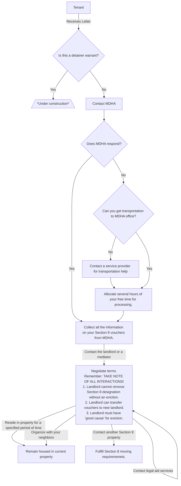

# Eviction Training

Eviction are a confusing and scary process. We hope the following document will help you, your loved ones, and your neighbors navigate the process and understand their legal rights.

## Low income

### Section 8

Section 8 is a government program that provides low income renters with subsidized rent via government checks directly to the renter's landlord.

